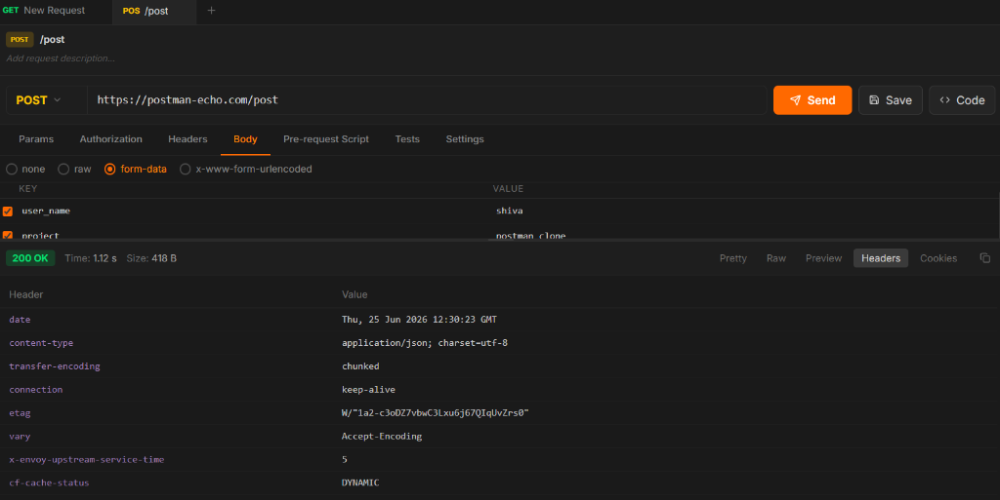
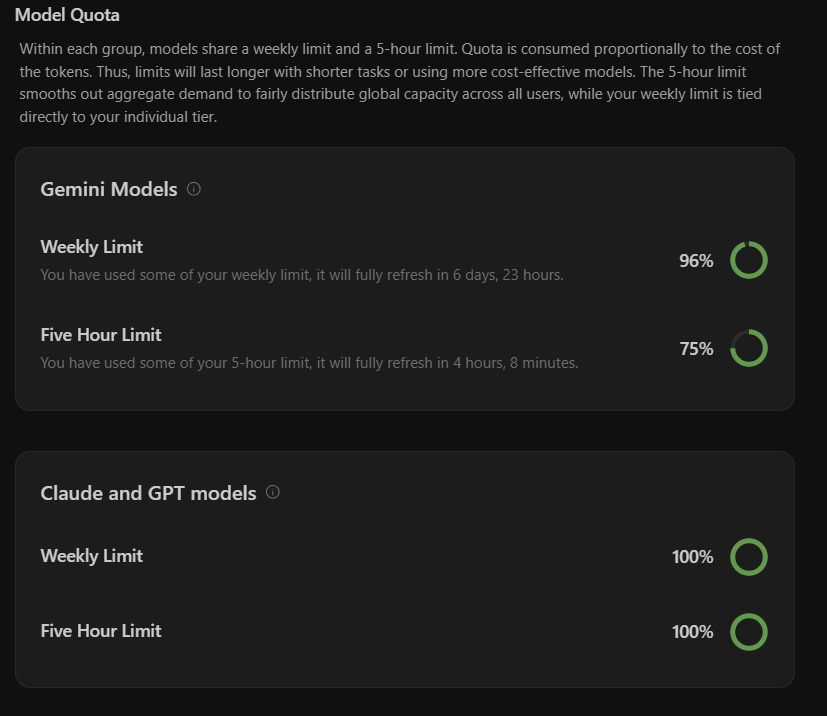
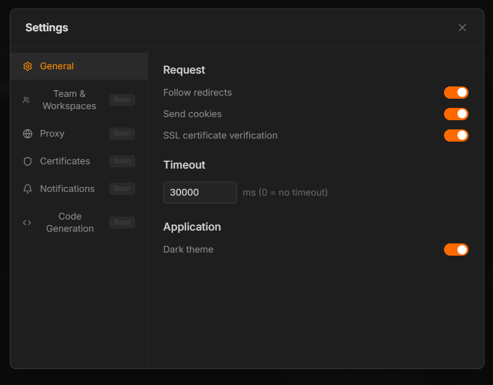
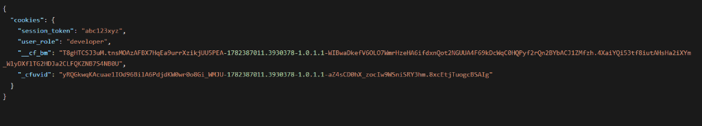
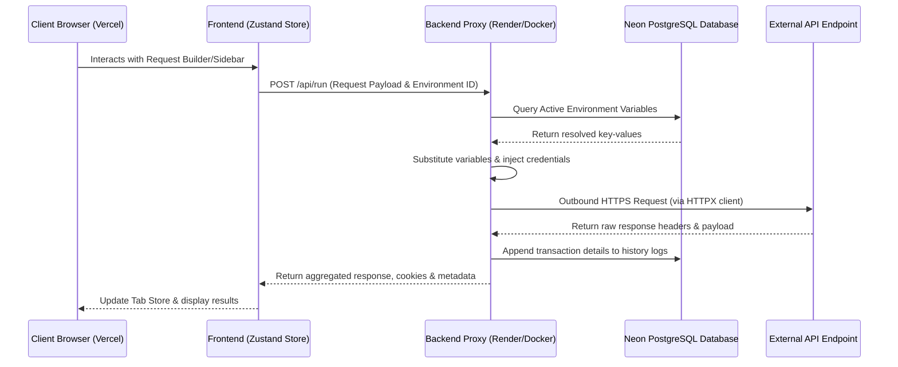
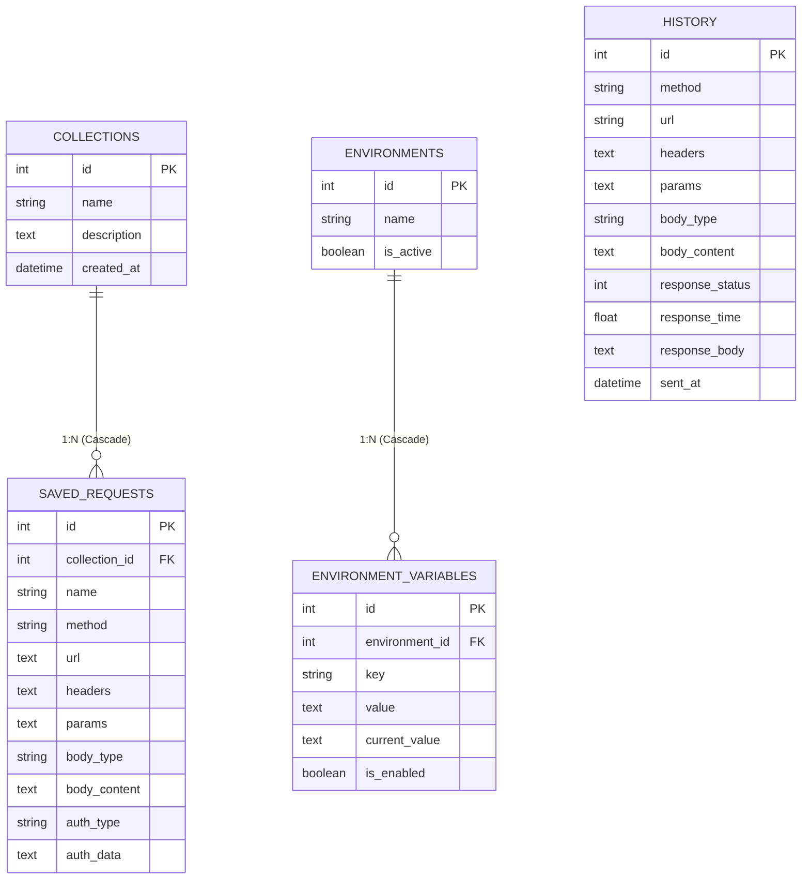

# 🚀 PostmanX — Advanced API Client Platform

[](https://postman-clone-backend-bgu4.onrender.com)
[](https://postman-clone-six-nu.vercel.app)
[](https://postman-clone-backend-bgu4.onrender.com/docs)
[](https://neon.tech)
[](./docker-compose.yml)

PostmanX is a high-performance, developer-focused API client and testing platform. Built with a modern dark aesthetic, it replicates core Postman workflows—enabling request building, stateful environment variables, collection execution, and live history logs—backed by a production-ready cloud database architecture.

---

## 📸 Interface Preview

### Core Workspace Dashboard
*A tabbed workspace supporting real-time syntax highlighting, custom auth modes, and live cookie headers table.*


---

## ✨ Features

### 🚦 Core HTTP Client
* **Dynamic Request Builder**: Support for all major HTTP methods (`GET`, `POST`, `PUT`, `DELETE`, `PATCH`, `HEAD`, `OPTIONS`).
* **Stateful Auth Protocols**: Quick setups for **API Key Auth** (injectable via header or query params), **Bearer Tokens**, and **Basic Auth** credentials.
* **Multipart Form-Data & URLencoded**: Easily construct payloads with file forms or key-value parameters.
* **Stateful Response Cookies**: Parses and lists incoming `Set-Cookie` headers into domain, path, expiry date, and flags (Secure/HttpOnly).
* **In-Response Content Search**: Highlight matching terms instantly inside Pretty/Raw response bodies without lag.

### 🔄 Advanced Automation & Utilities
* **Collection Runner**: Run entire collections sequentially. Set delay offsets, customize iteration limits, and monitor live test status with durations and status badges.
  
* **Auto-Generated API Documentation**: Instantly generate clean API documentation detailing query paths, request variables, payloads, and header properties.
  
* **Variable Autocomplete Dropdown**: Type `{{` in the URL bar or key fields to prompt autocomplete suggestions for enabled environment variables.
  
* **JSON Beautifier & Linter**: One-click formatting (auto-indentation) and automated syntax auto-repair (fixes trailing commas, double-quotes keys, closes braces).
* **Header & Parameter Bulk Editors**: Toggle between a visual grid layout and raw text list edit formats (`Key: Value`).
* **Tab-Header Context Actions**: Right-click tabs to close current, close others, or close all tabs.

---

## 🛠️ Tech Stack & Architecture

### The Stack
* **Frontend**: Next.js 16 (Turbopack), React 19, TypeScript, Tailwind CSS v4, Zustand State Manager, Sonner Toast Notifications.
* **Backend**: Python 3.11, FastAPI, Uvicorn, SQLAlchemy 2.0 ORM, HTTPX Client.
* **Database**: Neon Serverless PostgreSQL (Production) / PostgreSQL (Local).

### Request & Database Flow


---

## 🚀 Setup & Installation

### 1. Prerequisites
* **Node.js** 18+
* **Python** 3.11+
* **Docker** (Optional, for containerized runner)

### 2. Environment Variables Configuration
Create a `.env` file inside the `backend/` directory:
```env
# Database connection string (PostgreSQL)
DATABASE_URL=postgresql://<user>:<password>@<host>/neondb?sslmode=require

# CORS configuration (Origins allowed to access backend)
ALLOWED_ORIGINS=http://localhost:3000,https://postman-clone-six-nu.vercel.app

# Environment type (development / production)
APP_ENV=development

# Server configurations
PORT=8000
HOST=0.0.0.0
```

---

### 3. Local Setup

#### Backend (FastAPI)
```bash
cd backend
python -m pip install -r requirements.txt
python start.py
# Server starts at http://localhost:8000
# Interactive Swagger docs: http://localhost:8000/docs
```

#### Frontend (Next.js)
```bash
cd ../frontend
npm ci
npm run dev
# Dashboard starts at http://localhost:3000
```

---

### 4. Containerized Run (Docker Compose)
Launch both services cleanly inside containers with local network links:
```bash
# Start Docker compose orchestration
docker-compose up --build -d

# Stop containers and release volumes
docker-compose down -v
```

---

## 🗄️ Database Models Schema

PostmanX uses a structured SQL model to maintain persistent entities across workspaces:



---

## 🔌 API Reference Endpoints

### 📁 Collections & Requests
* `GET /api/collections` — List all collections.
* `POST /api/collections` — Create a new collection.
* `PUT /api/collections/{id}` — Edit name/description of a collection.
* `DELETE /api/collections/{id}` — Delete collection and all its requests (Cascade).
* `GET /api/collections/{id}/export` — Export a collection structure as JSON.
* `POST /api/collections/import` — Upload and import a collection structure from JSON.
* `GET /api/collections/{id}/requests` — Get all saved requests in a collection.
* `POST /api/requests` — Create and save a request within a collection.
* `PUT /api/requests/{id}` — Overwrite parameters of a saved request.
* `DELETE /api/requests/{id}` — Delete a saved request.

### 🌐 Environments & Variables
* `GET /api/environments` — Retrieve all environment configurations.
* `POST /api/environments` — Add a new environment block.
* `PUT /api/environments/{id}` — Save/update environment name and variables.
* `DELETE /api/environments/{id}` — Delete environment.
* `POST /api/environments/{id}/activate` — Set environment status to active.
* `POST /api/environments/deactivate` — Turn off all environments.

### ⏳ Execution & History Logs
* `GET /api/history` — Get query transaction logs (Supports `limit` query).
* `DELETE /api/history` — Clear history logs list.
* `DELETE /api/history/{id}` — Remove a single log record.
* `POST /api/run` — **Proxy Request Runner**. Resolves environment variables, formats payloads, sends requests using HTTPX, and returns the response metadata.

---

## 🔒 Security & Best Practices
1. **Credentials Redaction**: Environment variables stored on Neon DB use dual-state properties (`Initial Value` vs `Current Value`). Your backend prints hostname targets in log files while stripping credential tokens.
2. **CORS Normalization**: Backend allowed origins strictly strip trailing slashes (`.rstrip("/")`) on startup to guarantee browser preflight checks pass cleanly.
3. **Connection Pooling**: PostgreSQL connections include PgBouncer configuration parameters (`pool_pre_ping=True`, `pool_recycle=300`) to prevent database pool exhaustion or connection dropout timeouts.
